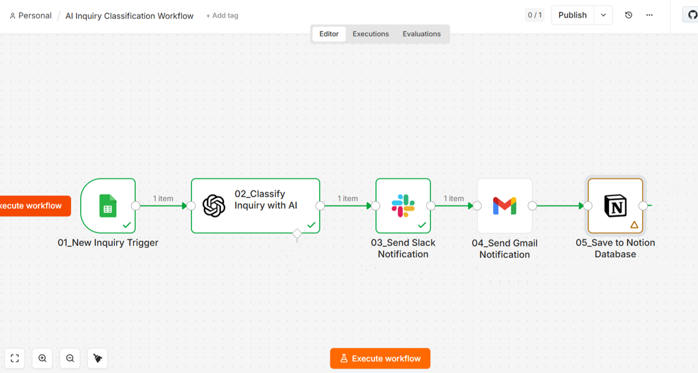

# AI Inquiry Notion Workflow

## Overview
AI-powered workflow that classifies and summarizes customer inquiries, then automatically stores the results into a Notion database.

## Workflow
Google Forms
↓
Google Sheets
↓
n8n Trigger
↓
OpenAI API
↓
AI Classification
↓
AI Summarization
↓
Notion Database
↓
Slack Notification
↓
Gmail Notification

## Features
- AI inquiry classification
- AI-generated inquiry summaries
- Automatic Notion database storage
- Slack notifications
- Gmail notifications

## Tech Stack
- n8n
- OpenAI API
- Notion API
- Google Sheets
- Slack
- Gmail

## Screenshots
### Workflow Overview

## Future Improvements
- Sentiment analysis
- Automatic inquiry assignment
- CRM integration
